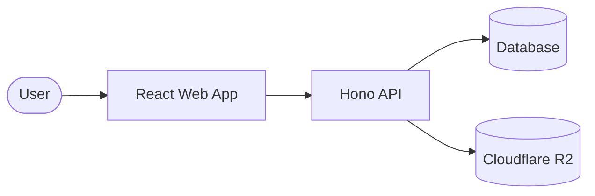
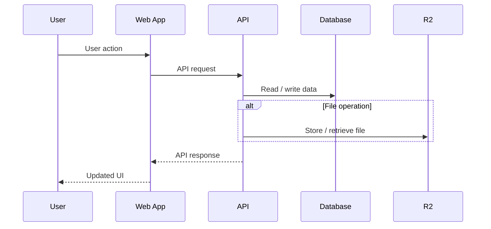
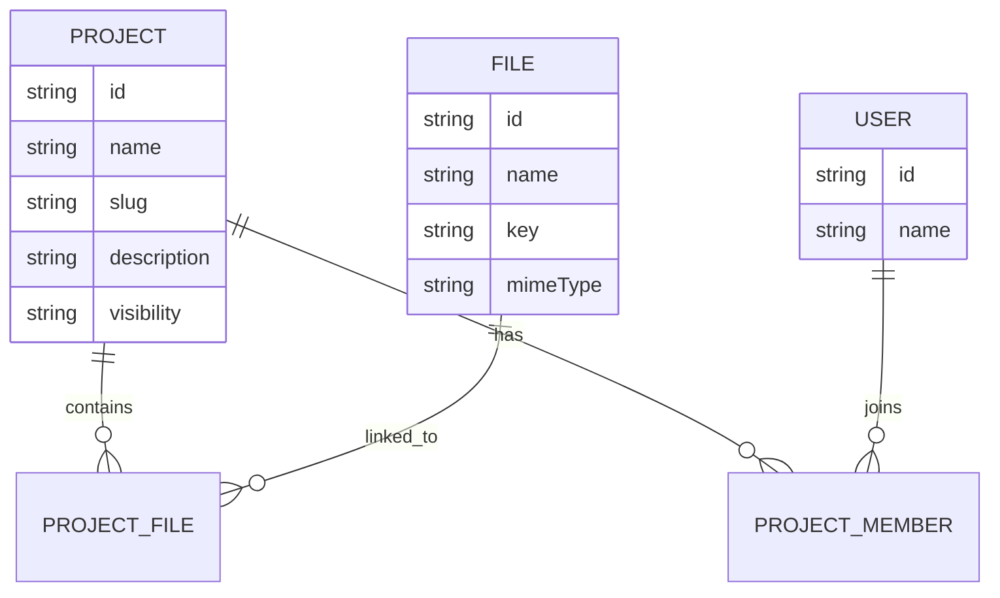
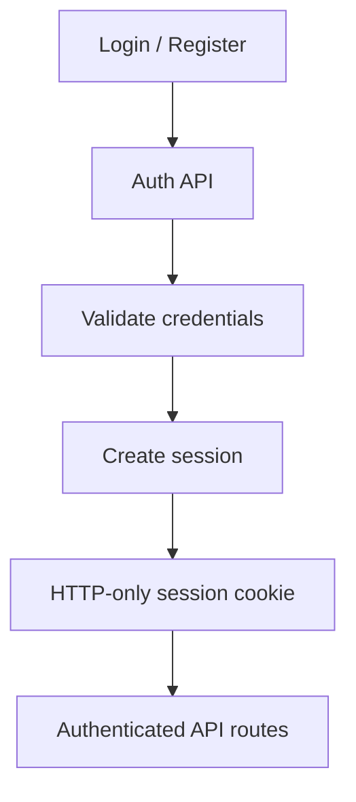
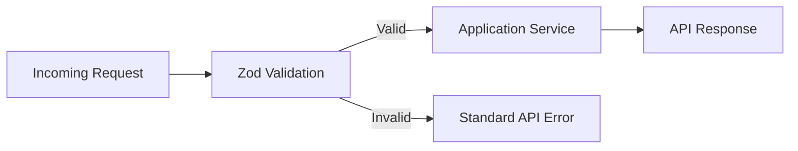
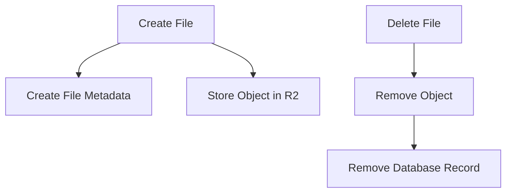

# 3DPC Workspace

> An online hub and workspace for a 3D printing club, bringing members, projects, files, resources, and club activities together in one place.

<div align="center">


</div>

---

## Overview

**3DPC Workspace** is a full-stack web application built for a 3D printing club, providing members with an online hub for collaboration, communication, and project management.

The platform gives club members a shared space to create and manage **3D printing projects**, organize their associated files, share project information, and collaborate with other members. It also provides club-facing resources and public content alongside authenticated workspace features.

The application is designed around two complementary experiences:

* **Workspace** — a more structured desktop-oriented environment for managing projects, files, and club work.
* **App** — a more accessible, mobile-friendly experience for members to stay connected with the club, view projects and resources, receive announcements and notifications, keep up with events and reminders, and access club information.

The project is built as a **TypeScript monorepo** with a React frontend and Hono API, with authentication, database-backed project and file management, user profiles, and cloud file storage.

---

## Architecture



The frontend communicates with the API rather than accessing the database or object storage directly.

### Request Flow



---

## Tech Stack

| Layer           | Technology              |
| --------------- | ----------------------- |
| Frontend        | React + TypeScript      |
| Styling         | Tailwind CSS            |
| UI              | shadcn/ui               |
| Routing         | React Router            |
| Server State    | TanStack Query          |
| API             | Hono                    |
| Validation      | Zod                     |
| ORM             | Drizzle ORM             |
| Database        | SQL database            |
| Object Storage  | Cloudflare R2           |
| Package Manager | pnpm                    |
| Repository      | pnpm workspace monorepo |

---

## Project Structure

```text
3dpc-workspace/
│
├── apps/
│   ├── web/
│   │   └── src/
│   │       ├── api/
│   │       ├── components/
│   │       ├── features/
│   │       │   ├── auth/
│   │       │   ├── projects/
│   │       │   ├── files/
│   │       │   └── ...
│   │       ├── layouts/
│   │       ├── pages/
│   │       └── lib/
│   │
│   └── api/
│       └── src/
│           ├── modules/
│           ├── middleware/
│           ├── lib/
│           └── db/
│
├── package.json
├── pnpm-workspace.yaml
└── README.md
```

The application is organized primarily **by feature** on the frontend. Feature-specific components, hooks, and related logic live together rather than being distributed across large global component directories.

---

## Core Concepts

### Projects

Projects are the primary organizational unit.

A project can contain:

* Project information
* Associated files
* Members
* Visibility settings
* Public-facing information



### Files

Files are represented in the database while their actual contents are stored in object storage.

```text
Database
   │
   ├── File metadata
   │   ├── name
   │   ├── type
   │   ├── size
   │   └── storage key
   │
   └── Project relationship
            │
            ▼
       Cloudflare R2
            │
            └── Actual file
```

This keeps application metadata separate from the binary file contents.

---

## Authentication

Authentication is handled by the API.



Protected requests are authenticated by the API before accessing user-specific resources.

---

## API Design

The API is organized around domain modules rather than a single large route file.

```text
/api
├── auth
├── users
├── projects
├── files
└── ...
```

Routes handle HTTP concerns while service functions contain the underlying application logic.

For example:

```text
Route
  │
  ▼
Validation
  │
  ▼
Service
  │
  ├── Database
  └── Storage
```

This keeps operations such as file deletion reusable from multiple routes instead of tying business logic to a particular HTTP endpoint.

---

## Validation & Errors

Request validation is handled at the API boundary using Zod.



The frontend uses a shared error-handling pattern to translate API validation errors into form errors.

For example:

```ts
handleMutationError(error, setError);
```

This allows server-side validation to appear directly on the corresponding form fields.

---

## File Lifecycle

Files require coordination between the database and object storage.



Project deletion accounts for this relationship by removing associated files through the file deletion logic before allowing the project relationships to cascade.

---

## Frontend Organization

The frontend follows a feature-oriented structure:

```text
features/
│
├── auth/
│   ├── components/
│   ├── hooks/
│   └── ...
│
├── projects/
│   ├── components/
│   ├── hooks/
│   └── ...
│
├── files/
│   ├── components/
│   ├── hooks/
│   └── ...
│
└── ...
```

Shared UI primitives remain outside feature directories:

```text
components/
├── ui/
└── ...
```

Feature-specific components stay with the feature that owns them.

---

## Development

### Requirements

* Node.js
* pnpm
* Database
* Cloudflare R2-compatible storage configuration

### Install

```bash
pnpm install
```

### Development

Run the workspace applications using the configured package scripts:

```bash
pnpm dev
```

### Build

```bash
pnpm build
```

---

## Environment

Environment variables are kept outside source control.

Typical configuration includes:

```text
Database connection
Session configuration
R2 credentials
Frontend API URL
```

Refer to the environment files used by each application for the complete configuration.

> **Note:** Never commit API keys, database credentials, session secrets, or storage credentials to the repository.

---

## Design Approach

A few principles guide the current implementation:

* **Feature-oriented frontend structure**
* **API-first data access**
* **Server-side validation**
* **Reusable mutation and error handling**
* **Separation of database metadata and file storage**
* **Reusable service-layer operations**
* **Small, composable UI components**

The goal is to keep individual features understandable without requiring the entire application structure to be understood first.

---

## Status

> 🚧 **Active Development**

The application is currently under active development, with core authentication, project management, file handling, and frontend infrastructure in place.

---

## License

This project is currently not licensed for redistribution.
